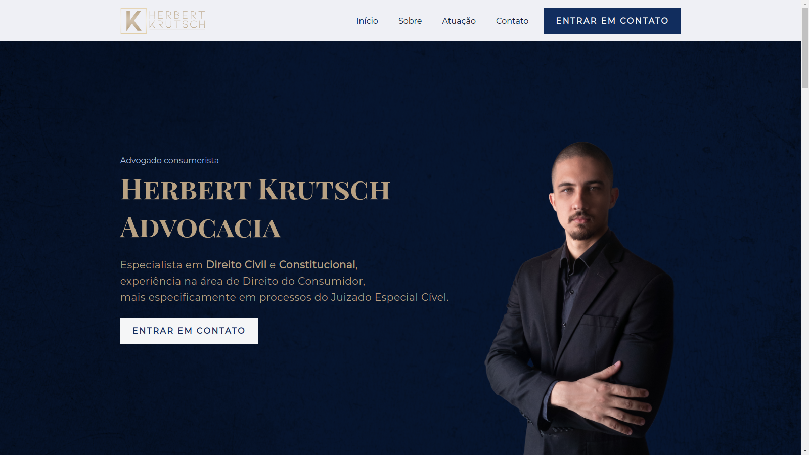

<h1 align="center">
  
</h1>

  <a href="#-projeto">Projeto</a>&nbsp;&nbsp;&nbsp;|&nbsp;&nbsp;&nbsp;
  <a href="#-tecnologias">Tecnologias</a>
 

 

  

<!-- 

  

 -->

 

## 💻 Projeto

Landing Page para cliente advogado tendo como principais partes:

- Apresentação com foto
- Sobre mim
- Destaques
- Áreas de atuação
- Depoimentos de clientes
- Contato por WhatsApp
- Contato por e-mail
- Feed do Instagram

 

## ✨ Tecnologias

Esse projeto foi desenvolvido com as seguintes tecnologias:

- HTML
- CSS
  - FlexBox
  - Grid Layout

---
